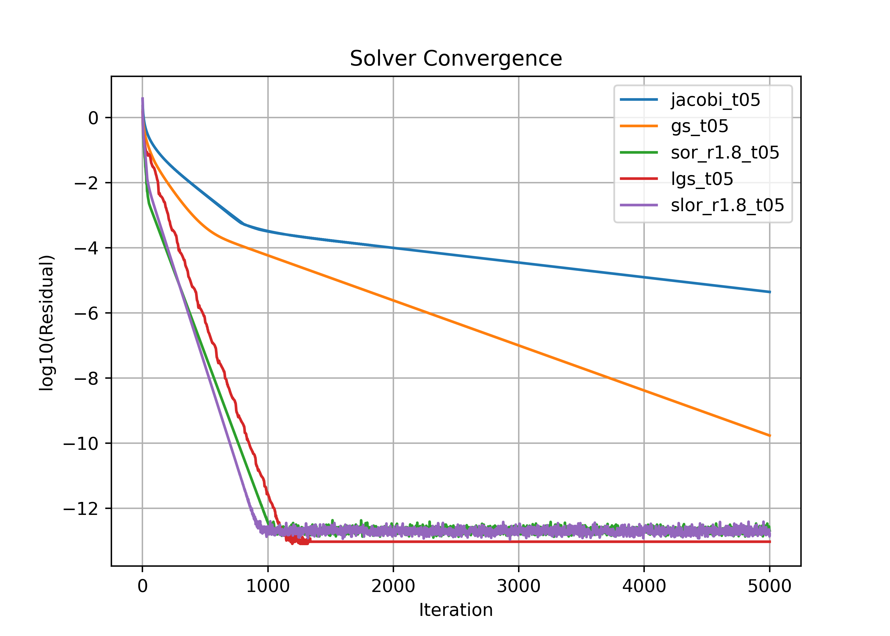
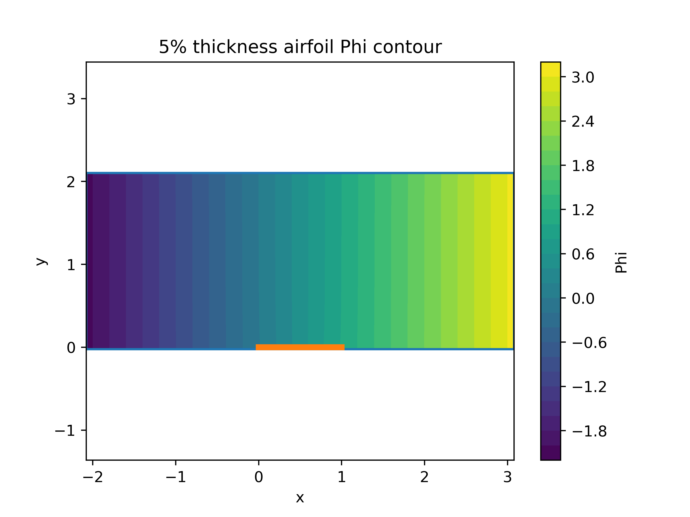
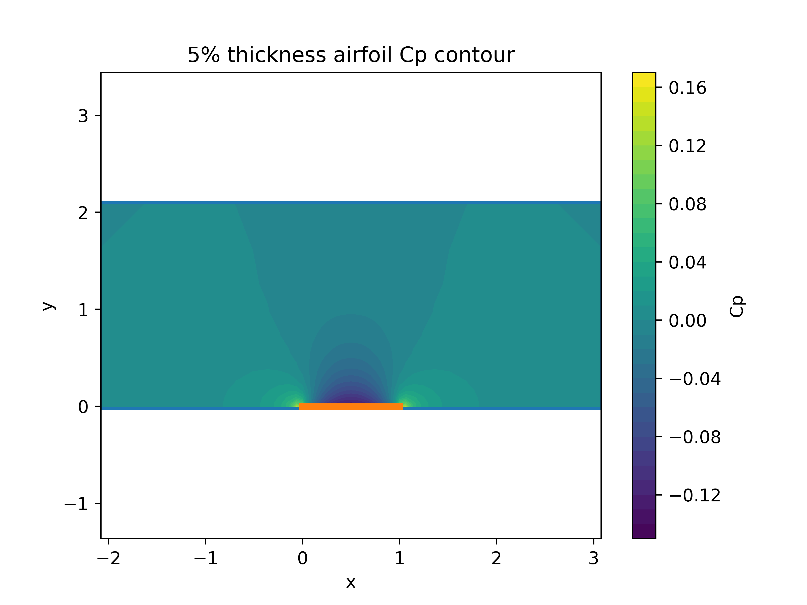
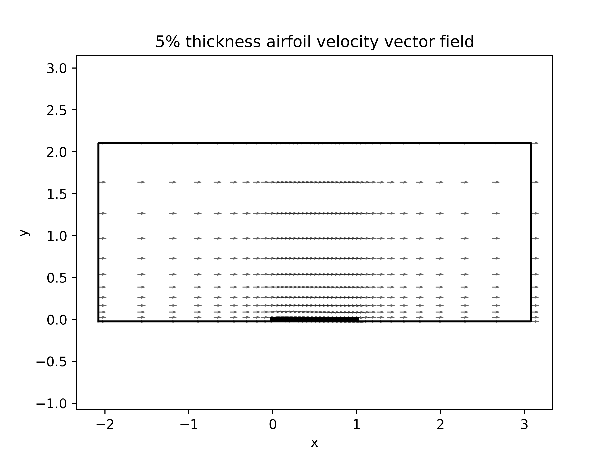
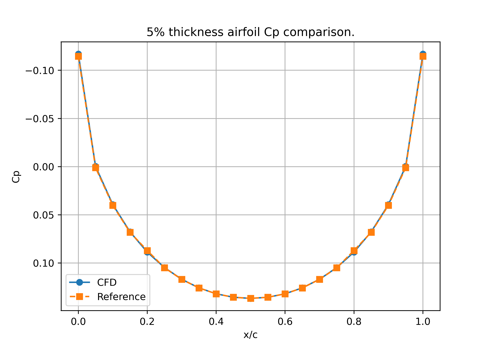

# 2D Potential Flow Solver (Laplace Equation)

A Computational Fluid Dynamics (CFD) solver written in **Rust** to solve the 2D Laplace equation for incompressible, irrotational potential flow over a biconvex airfoil. The project includes a set of iterative schemes and a **Python** post-processing pipeline for data visualization.

---

## Features

### **Core Solver (Rust)**
* **Governing Equation:** Solves the 2D Laplace equation in Cartesian coordinates for the velocity potential $\phi$:
  $$\nabla^2 \phi = \frac{\partial^2 \phi}{\partial x^2} + \frac{\partial^2 \phi}{\partial y^2} = 0$$
* **Airfoil Geometry:** Implicitly handles a biconvex airfoil profile defined by:
  $$y = 2t x(1-x)$$
  where $t$ is the maximum thickness.
* **Custom Mesh Generation:** Builds a structured Cartesian grid with configurable algebraic stretching factors (`XSF`, `YSF`) to cluster nodes near the airfoil surface.
* **Boundary Conditions:**
    * **Far-field:** Uniform free-stream flow ($\phi = U_\infty x$).
    * **Symmetry:** $\frac{\partial \phi}{\partial y} = 0$ outside the airfoil chord.
    * **Solid Wall (Tangency):** Implements the small-disturbance surface boundary condition applied at $y=0$:
      $$\frac{\partial \phi}{\partial y} = U_\infty \frac{dy}{dx}$$
* **Data Export:** Exports structured data (Mesh, $\phi$, $u$, $v$, $C_p$, and surface $C_p$) to CSV format for post-processing.

### **Iterative Schemes**
The solver implements multiple iterative schemes using an Trait-based approach in Rust:
1.  **Point Jacobi:** Standard explicit updating.
2.  **Point Gauss-Seidel (GS):** In-place sequential updating.
3.  **Successive Over-Relaxation (SOR):** Gauss-Seidel modified with a relaxation factor $r$.
4.  **Line Gauss-Seidel (LGS):** Implicit in the $y$-direction (solved via the **Thomas Algorithm** for tridiagonal systems) and explicit in the $x$-direction.
5.  **Successive Line Over-Relaxation (SLOR):** LGS modified with a relaxation factor $r$.

### **Post-Processing (Python)**
* Extracts velocity fields using central finite differences:
  $$u = \frac{\partial \phi}{\partial x}, \quad v = \frac{\partial \phi}{\partial y}$$
* Calculates the Pressure Coefficient ($C_p$) using the linearized Bernoulli equation.
* Generates contour plots, vector fields, and residual history graphs.

---

## Project Structure

```text
├── src/
│   ├── main.rs               # Application entry point & configuration
│   ├── solver_core.rs        # Main iteration loop & boundary conditions
│   ├── mesh.rs               # Grid generation with stretching
│   ├── config.rs             # Simulation parameters 
│   ├── solver_utils.rs       # Output writers, TDMA, velocity/Cp calculations
│   └── it_schemes/           # Implementation of Jacobi, GS, SOR, LGS, SLOR
├── job_files/                # Output directory for mesh, solutions, and logs
├── preproc/                  # Python scripts for mesh visualization
└── postproc/                 # Python scripts for contour, vector, and residual plotting
```

## Compilation and Execution
1. Running the Solver (Rust)

- To configure the simulation, edit the parameters inside the main() function in src/main.rs (e.g., changing the solver scheme or adjusting the thickness t).

- Run the solver in release mode:

  - cargo run --release

- CSV files will be generated inside the respective job_files/<jobname>/solution_data/ directory.

2. Generating Plots (Python)

- Ensure you have the required Python libraries installed:

  - pip install numpy pandas matplotlib

- Run the post-processing scripts to generate the visualizations:

  - python postproc/plot_results.py
  - python postproc/validation.py
  - python postproc/compare_residuals.py


## Results & Visualizations

1. Maximum residual error per iteration for the different numerical schemes implemented.



2. Velocity Potential (ϕ)



3. Pressure Coefficient (Cp​) Field



4. Velocity Vector Field



Velocity vectors near the airfoil surface.
5. Surface Cp​ Validation



---
## License

This educational purpose code was developed for a project in CC-297 (Fundamentals of Computational Fluid Dynamics) class at post-graduate ITA.

